# reachOut
A full stack website for the web development course. This website is a volunteering website where people can either ask for help or they can volunteer to help.
So people either rech out FOR help or reach out TO help.
This website will be created using laravel and a mysql database.

We have 3 users type. 
The admins who will be in charge of deleting users (smammers).
The users who are in need of volunteers or giving people oportunities to volunteer.
The volnteers who are looking to contributes.

most impotant features:
-The users will be able to post volunteering event with deleted information about it including date, time and location and volunteers will be able to apply to these events.
-on the pofile of the volunteers will be listed all their information + the volunteering they have done so far.
-their profile can be shared and printed as a pdf file also to share it.  
  
  ## Landing page  
  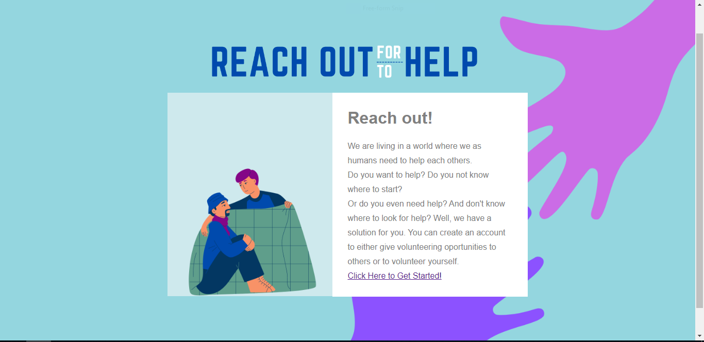  
  you can get an overview and get redirected to sign in.

  ## redirection page

  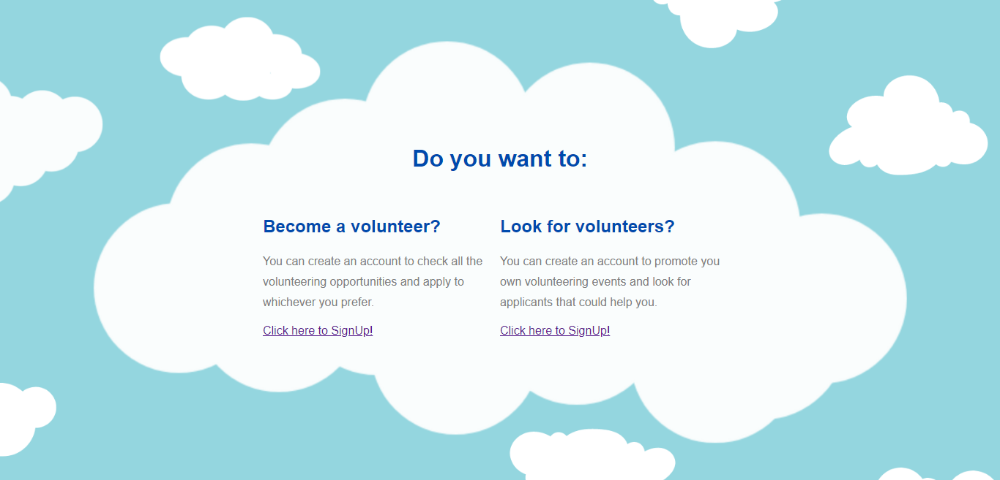  
  to pick which usertype to be.  

  ## Sining up as volunteer and as a company 
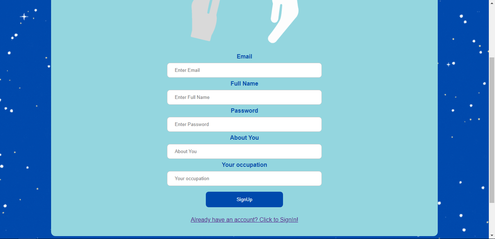  
    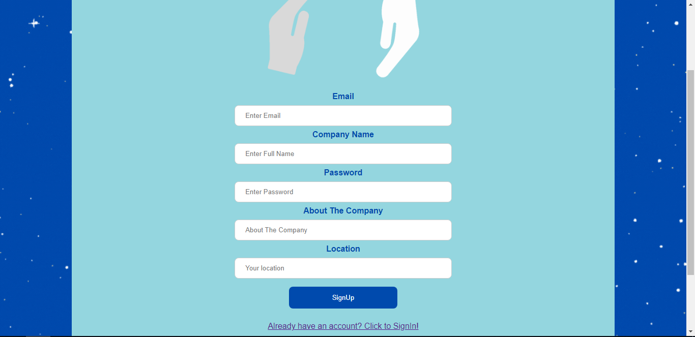

## Login for both  
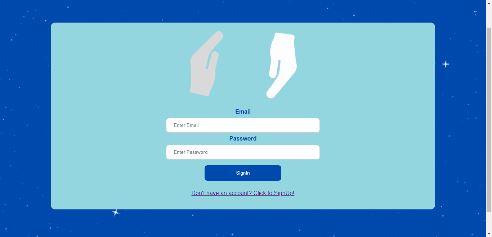  

 ## Volunteer pages  
 ### Volunteers' homme page
 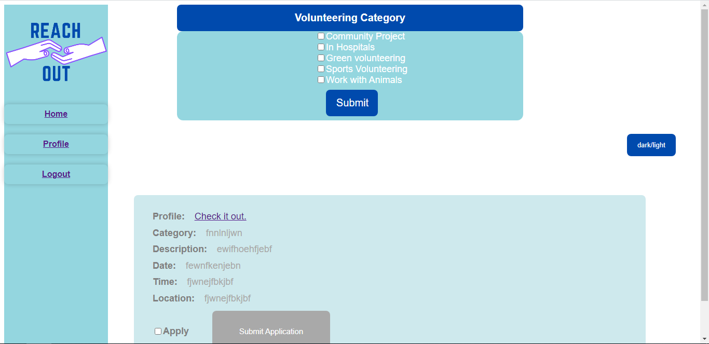  
 where they can look through volunteering events and apply to what they want. They can also pcik the categories they would like.  

 ### Volunteers' profile page  
 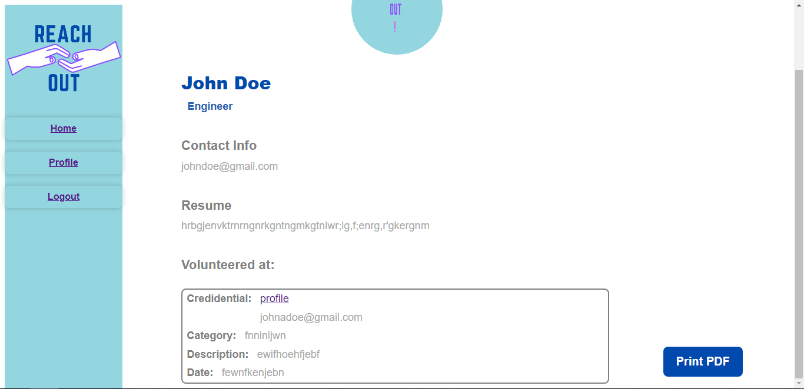
 where they can print it as a cv pdf version:
 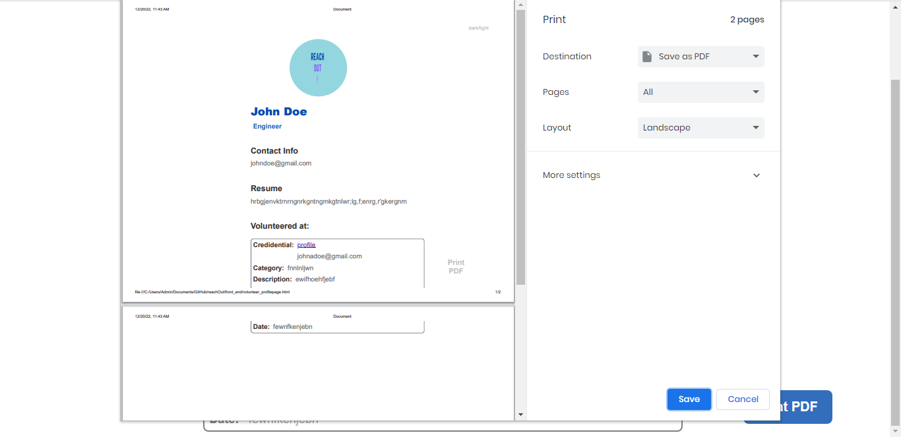  

## Company pages
### company Home Page
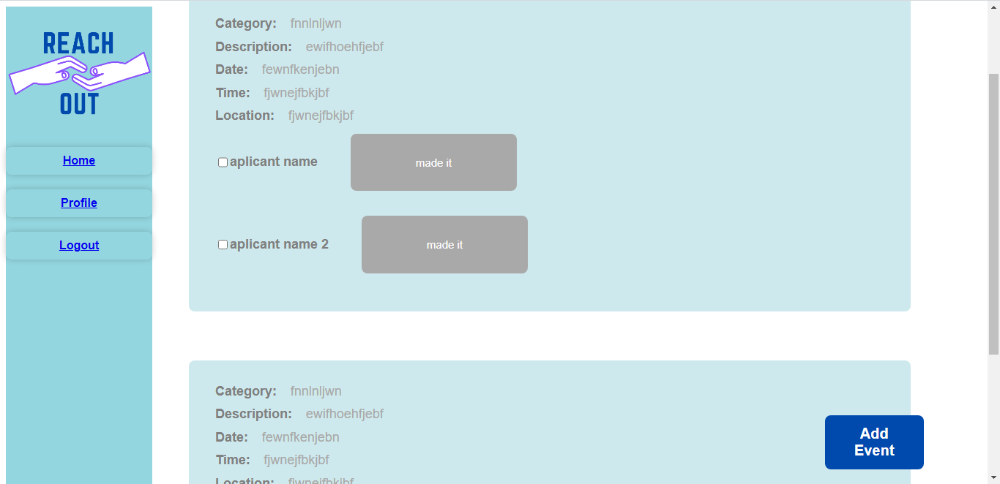
Where they can look through the events they created and approve of the volunteers that did attend.  
There is also a button in order to add more volunteering events.  

### Company event making page   
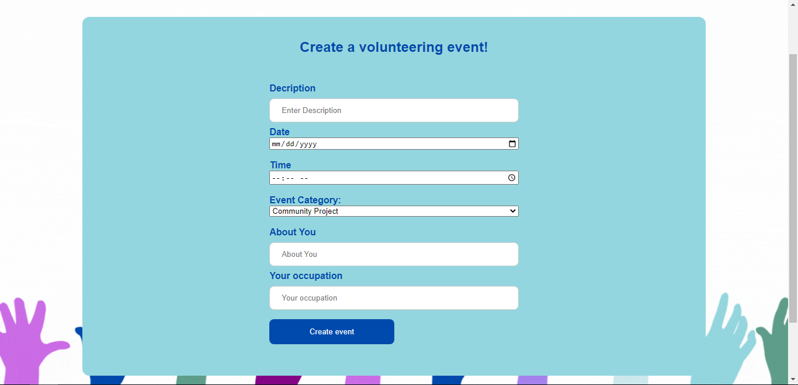

### Comapny profile  
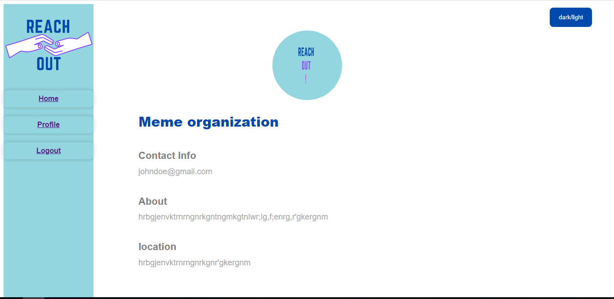  

## Demo of the dark mode
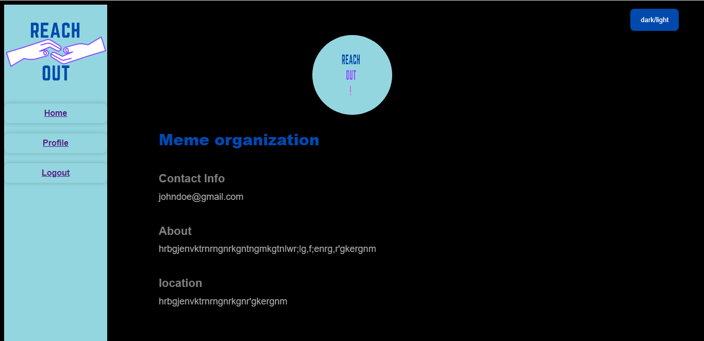
the light/dark button is a switch button to be able to switch between dark and light mode

